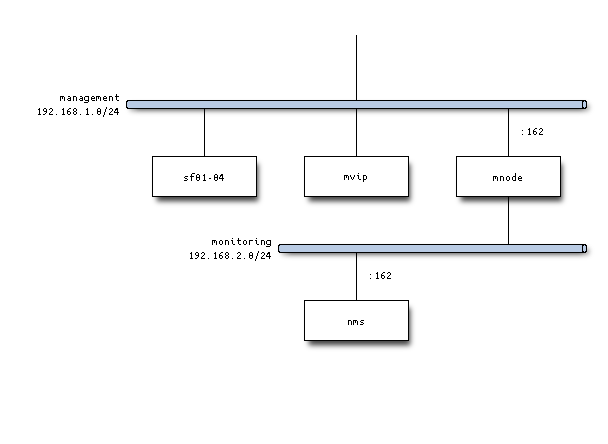

## SNMP Trap Forwarding (SNMPv2c to SNMPv3) for SolidFire 12.3 SNMP Traps

As you've just read, we want to forward SNMP Traps sent by SolidFire, while converting them to SNMPv3.

This is one of the scenarios described [here](https://snmplabs.thola.io/snmpfwd/configuration/examples/trap-forwarding-snmpv2-to-snmpv3.html).

You'd need [snmpfwd](https://github.com/inexio/snmpfwd).

```shell
pip install snmpfwd
```

### Setup

- Intended destination for SNMPv3 Traps is snmptrapd 192.168.1.12:162
- SF Demo VM sends SNMPv2 traps to my 192.168.1.12:1162 (where snmpfwd "server" is listening)
- snmpfwd-server receives v2 traps, and forwards them to snmpfwd-client
- snmpfwd-client forwards trap contents in SNMP v3 format to snmptrapd listening at port 162
- My snmptrapd receives v3 Traps on port 162

#### Example network diagrams

Config files attached here are based on a scenario like this: snmpfwd-client-server (port 1162) & snmptrapd (port 162) all run on the same node.


Slightly more realistic scenario is given below. SNMP forwarder client and server run in dedicated VM (let's call it mNode), while SNMPv3 traps are received by a host on another network reachable to mNode.



Sample config files from this repo have just one network, 192.168.1.1/24, and apart from SolidFire everything is collapsed into one host - that is why SolidFire sends SNMP traps to port 1162 (because SNMPv3 Trap service is on port 162).

### Steps to reproduce

- Start forwarding server and client:

```sh
snmpfwd-server.py --config-file=server.conf --debug-snmp=msgproc,app --log-level=debug
snmpfwd-client.py --config-file=client.conf --debug-snmp=msgproc
```

- Start Wireshark to watch for SNMP traffic on 192.168.1.12(:162) or watch snmptrapd.log

- Use SnmpSendTestTraps method on SolidFire to send SNMP Test Trap. SolidFire 12.3 sends these as SNMP version 2.

```json
{
	"method": "SnmpSendTestTraps",
    "params": {},
    "id": 1
}
```

- Watch logs from snmpfwd-server, snmpfwd-client and snmptrapd.log or Wireshark capture with snmp filter. You should see SNMPv2 test trap come in via snmpfwd-client and get forwarded to 192.168.1.12:162.

### Screenshots

In Wireshark we can see SNMPv3 Trap has been received. It has Engine ID set in `client.conf`. User name is `netapp`, also configured in the same file.


Further below, the original message (SNMPv2) is included, and contains SolidFire OIDs.


SolidFire sends traps to port 1162, configured in `client.conf`. This doesn't matter in the sense that we didn't wait for any SolidFire Faults or Events to happen, *except* this setting is used by `SnmpSendTestTraps` to determine where test trap will be sent.


Two configuration files used are attached here. SolidFire MVIP was 192.168.1.30. snmptrapd (snmptrapd.conf) used default settings on Ubuntu and wasn't even logging anything - I got all the info I needed from Wireshark.

Feel free to experiment and change the values in config files to suit your network and needs. They were adjusted from the snmpfwd documentation page linked at the top. I just used those played for 30 minutes until I got it to work.
