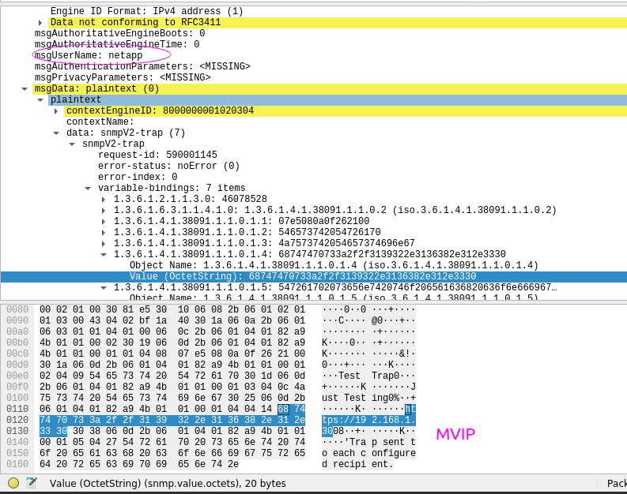

## SNMP Trap Forwarding (SNMPv2c to SNMPv3) for SolidFire 12.3 SNMP Traps

As you've just read, we want to forward SNMP Traps sent by SolidFire, while converting them to SNMPv3.

This is one of the scenarios described [here](https://snmplabs.thola.io/snmpfwd/configuration/examples/trap-forwarding-snmpv2-to-snmpv3.html).

You'd need [snmpfwd](https://github.com/inexio/snmpfwd).

```shell
pip install snmpfwd
```

### Setup

- Intended destination for SNMPv3 Traps is snmptrapd 192.168.1.12:162
- SF Demo VM sends SNMPv2 traps to my 192.168.1.12:1162 (where snmpfwd "server" is listening)
- snmpfwd-server receives v2 traps, and forwards them to snmpfwd-client
- snmpfwd-client forwards trap contents in SNMP v3 format to snmptrapd listening at port 162
- My snmptrapd receives v3 Traps on port 162

#### Example network diagram

Config files and above text don't correspond to this picture and we wouldn't run SNMP forwarder client and server on mNode.

But as an example, some other VM could be setup to receive SNMPv2 traps from SF MVIP and MIP(s), and forward them as SNMPv3 traps to another network.


Our example from this page has just one network, 192.168.1.1/24, and that is why I send SolidFire traps to port 1162 (because my destination service is on port 162).

In the diagram above, mNode could listen on 192.168.1.12:162 and forward to NMS listening on the same port but on a different network (192.168.1.2).

### Steps

- Start forwarding server and client:

```sh
snmpfwd-server.py --config-file=server.conf --debug-snmp=msgproc,app --log-level=debug
snmpfwd-client.py --config-file=client.conf --debug-snmp=msgproc
```

- Start Wireshark or watch snmptrapd.log

- Use SnmpSendTestTraps method on SolidFire to send SNMP Test Trap. SolidFire 12.3 sends these as SNMP version 2.

```json
{
	"method": "SnmpSendTestTraps",
    "params": {},
    "id": 1
}
```

- Watch your destination (snmptrapd.log) or Wireshark for SNMPv3 trap notifications

### Screenshots

In Wireshark I can see SNMPv3 Trap has been received. It has Engine ID set in `client.conf`. User name is `netapp`, configured in the same file.


Further below, the original message (SNMPv2) is included, and contains SolidFire OIDs.



SolidFire sends traps to port 1162, configured in `client.conf`.


Configuration files used (except snmptrapd.conf which used default settings on Ubuntu and wasn't even logging anything) are attached here.

Feel free to experiment and change them, I just played with this for 30 minutes until I got it to work.
